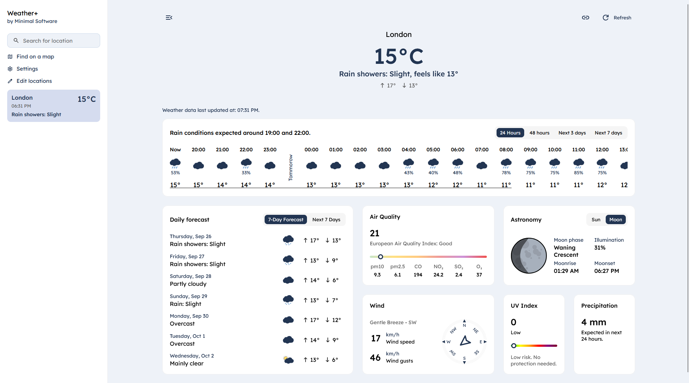

# Weather+ by Minimal Software

_See more screenshots in the [screenshots](screenshots) directory._

### Features:

### Data sources:
- Weather data is provided by [OpenWeatherMap](https://openweathermap.org/).
- Location autocomplete is provided by [Photon Komoot](https://photon.komoot.io/).
- Reverse geocoding is provided by [Nominatim](https://nominatim.openstreetmap.org/).
- Map tiles are provided by [OpenStreetMap](https://www.openstreetmap.org/) (Standard layer) and [Stadia Maps](https://stadiamaps.com/) (Satellite layer).

### Roadmap:
- [ ] Translate the application to other languages including German, Polish, French, Spanish, Italian, Chinese (simplified), Hindi, Arabic, Ukrainian, Japanese, Turkish, Portuguese, Korean, Swedish, Dutch, Greek and Bulgarian.
- [ ] Improve responsive web design (RWD) for mobile devices.